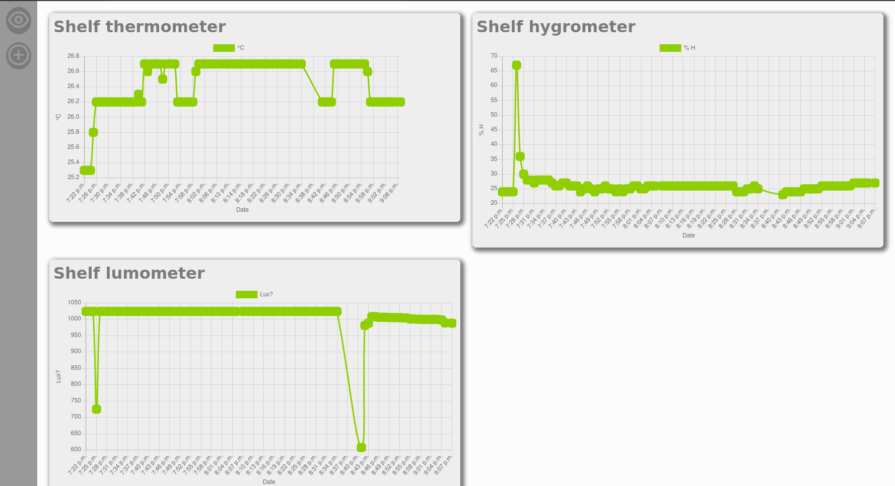

# Domoponics
This repository was create by Lucas Gamez.

# Overview
Django project for monitoring plants and aquariums in a domotics system at home.

List of sensor are available at: server_ip:8000/sensors/.

This project need a lot of work, one of them being to properly write this ReadME

 # List of ideas/features/tasks to work on:

* Proper ReadME
## ESP/Sensor
* Improve luminosity reading
## Improvmenet of the dataset:
* Add location ~~ and data_type as table, not as text ~~
* Location table is linked to a map of the house
* ~~ data_type table will enable to print uniformelly same type sensor (unit, color ...) ~~
* Add push time to sensor to manage how often data are saved
* ~~ Add ESP table, an esp can have several sensor ~~

## Improve graph:
* Limit graph data sent to front (especially to list sensors)
* Add button to choose time scale
* Page to superpose sensors
* Fancy graph for sensor detail and fuse graph
## Fix html/css
* The flex for list should be dynamic
* Bigger size for sensor detail
* Better style (Just grey is sad)
* Make the whole thing responsive
* Better base for tomorrow: create proper component
